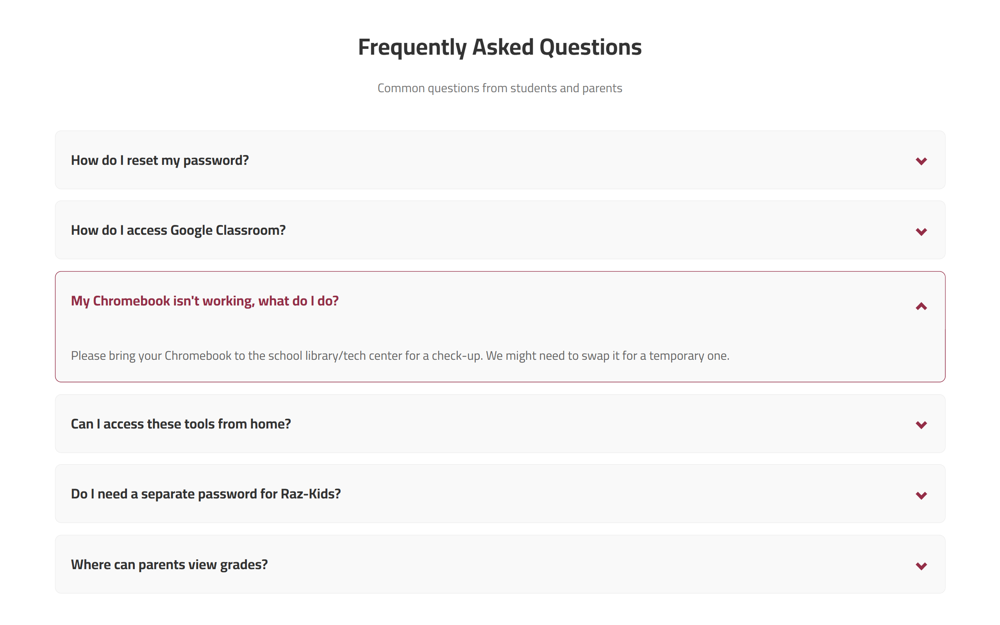
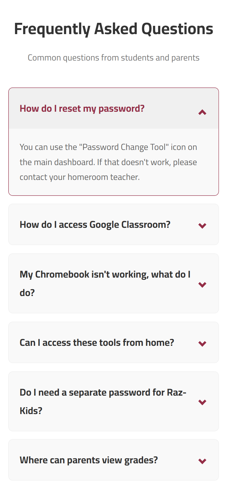

# Elementary Student Portal Redesign (HCI Task)

This project is a redesign of an Elementary Student Portal. The goal was to apply **Human-Computer Interaction (HCI)** principles to fix usability issues and create a better experience for young students.

## Project Overview
The original website was difficult for students to use. It was crowded, messy, and hard to navigate.
Our goal was to transform it into a **clean, modern, and easy-to-use** platform.

We focused on:
* **Consistency:** Making everything look and work the same way.
* **Simplicity:** Removing clutter so students can focus.
* **Mobile Responsiveness:** Ensuring it works perfectly on phones and tablets.

---

## The Problem (Before)

The old design had several critical issues:
* **Chaotic Layout:** Over 20 icons with no clear order.
* **Hard to Search:** The search bar was small and hidden.
* **Inconsistent Icons:** Different shapes and sizes made it confusing.
* **Bad Experience:** The messy look frustrated students.

---

## The Solution (After)
We redesigned the portal to be structured and user-friendly.

### 1. The Dashboard (Homepage)
* **Big Search Bar:** We placed a large search bar in the center for quick access.
* **Card Design:** We used uniform "cards" for all links to make them look tidy.
* **Categories:** We organized tools into groups like "Learning Tools," "Library," and "Help".

---

## Extended Features (New Support Pages)
We didn't just fix the homepage; we created a complete support system.

### 1. Frequently Asked Questions (FAQ)
We made it easy to find answers without reading too much text.
* **Expandable Lists:** Answers are hidden until you click the question. This keeps the page clean.
* **Mobile Friendly:** It looks great on small screens.

 

*(Or go to the pdf Presentation Page 14)*

### 2. Contact Support
We created a simple way for students to ask for help.
* **Clear Forms:** Large input boxes that are easy to tap on touch screens.
* **Distraction-Free:** We removed unnecessary elements so students can focus on writing their message.

[]
[]
*(Click images to view details or go to the pdf Presentation Page 15)*

### 3. Live Chat Support (Smart Layout)
This is our most advanced feature. The design changes based on the device.

* **Desktop View:** Shows the help information and the chat window side-by-side.

[]
*(Click images to view details or go to the pdf Presentation Page 16)*

* **Mobile View (Split Flow):** To save space on small screens, we split it into two steps:
    1.  **Step 1:** Info Screen (Working hours & "Start" button).
    2.  **Step 2:** The Chat Interface (Scrolls down smoothly).

[]
[]
*(Click images to view details or go to the pdf Presentation Page 17)*

---

##  HCI Principles Used
We applied core Human-Computer Interaction principles to ensure success:
* **Visibility:** Important things (like Search) are big and easy to see.
* **Affordance:** Buttons look clickable.
* **Feedback:** The system tells the user what is happening (e.g., "Support is Online").
* **Consistency:** Colors and fonts are the same across all pages.

---

##  Team Members:
1.  **Ahmed Mohamed Elsayed Mohamed Elboray**
2.  **Mahmoud Elhussieny Mohamed Mady**

---
